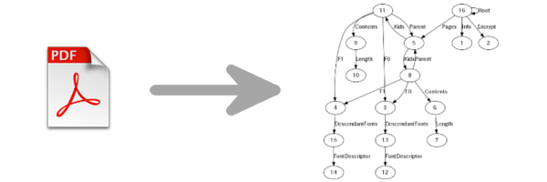

# pdfg.py - PDF object graph generator
## SYNOPSIS
pdfg [-h] [-T] [-o output.png] input.pdf 
## DESCRIPTION

## OPTIONS
    -h, --help            show this help message and exit  
    -T, --debug-with-token    print token strings.  
    -o, --output-png OUTPUT_PNG    path to a png file to be written. the default path is ./out.png.
